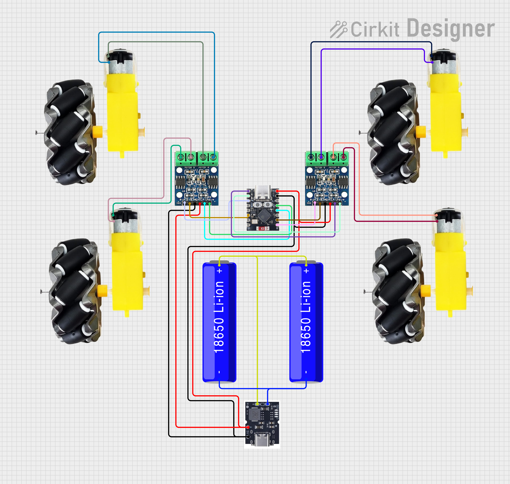

# ESP32 Tiny Rover

Mini rover **4 roues motrices à propulsion différentielle**, piloté par un **ESP32-C3 SuperMini** et conçu pour être commandé en **ESP-NOW**.

Le rover utilise quatre moteurs TT, deux drivers L9110S et une alimentation basée sur deux cellules 18650 et un module powerbank FM5324.

## Matériel principal

- 1 × ESP32-C3 SuperMini
- 2 × L9110S (double pont en H)
- 4 × moteurs TT DC à réducteur
- 1 × module powerbank FM5324
- 2 × cellules Li-ion 18650

## Commande des moteurs

Les huit entrées des deux L9110S sont pilotées indépendamment par l'ESP32-C3.

| Côté | L9110S | Entrée | GPIO ESP32-C3 |
|---|---|---|---:|
| Gauche | 1 | A1 | 3 |
| Gauche | 1 | A2 | 4 |
| Gauche | 1 | B1 | 7 |
| Gauche | 1 | B2 | 10 |
| Droit | 2 | A1 | 5 |
| Droit | 2 | A2 | 6 |
| Droit | 2 | B1 | 0 |
| Droit | 2 | B2 | 1 |

Les deux moteurs d'un même côté seront synchronisés par logiciel. Le rover tourne par différence de vitesse et/ou de sens entre le côté gauche et le côté droit.

## Documentation

La documentation complète du circuit, avec schéma de câblage, architecture d'alimentation et BOM, est disponible ici :

**[Ouvrir la documentation complète](https://nanou974.github.io/ESP32-tiny-rover/)**

## État du projet

- Châssis 3D : conçu
- Roues/jantes : conçues et imprimées
- Pneus TPU : en cours/finalisation
- Schéma électronique : établi
- BOM : ajoutée à la documentation
- Firmware ESP-NOW : à venir

## Vérifications avant mise sous tension

La documentation signale deux points à vérifier sur le matériel réel avant alimentation :

1. La fonction exacte de la broche 5 V/VBUS du modèle d'ESP32-C3 SuperMini utilisé.
2. Le brochage et la capacité en courant du module FM5324 utilisé.

Aucun firmware définitif n'est encore inclus dans ce dépôt.
